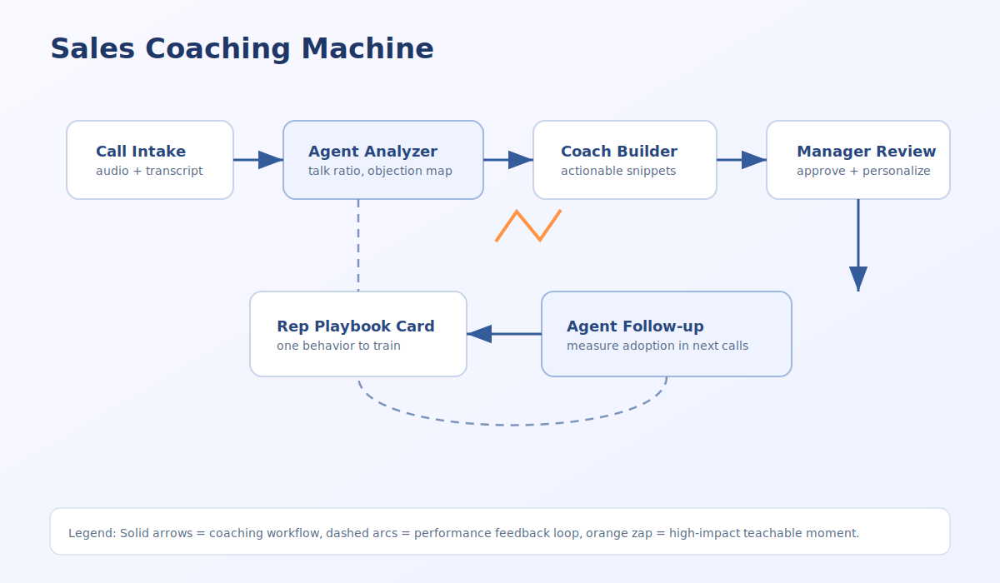
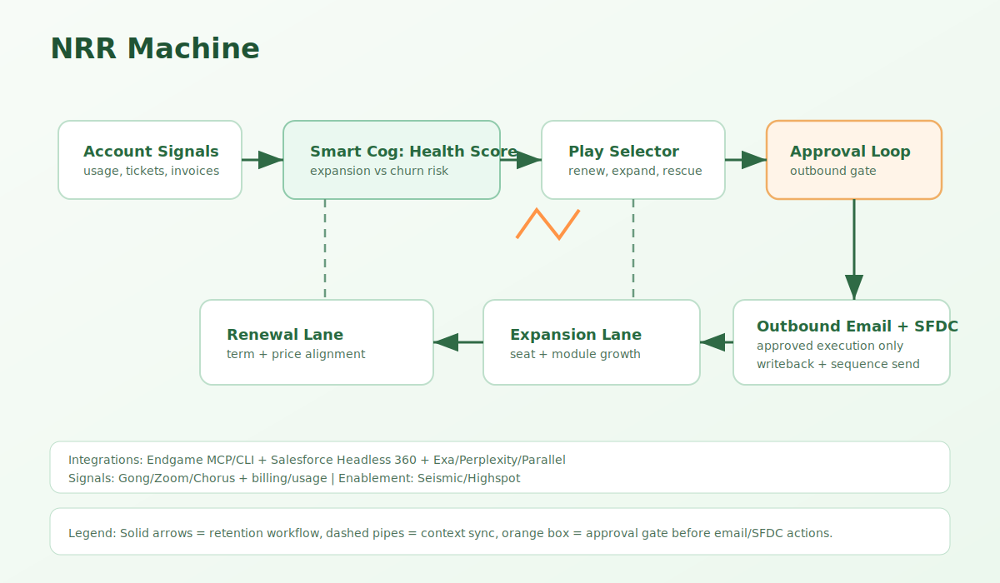

# mechanizer

`mechanizer` is a contract-first library of reusable revenue automation schematics.

Deterministic workflows are still the backbone of reliable revenue automation, but the next generation of orchestration adds **agentic reasoning gates** only where judgment is required. In `mechanizer`, those reasoning nodes are modeled as **Smart Cogs**: contract-bound units that can use MCP, CLI, and API tools with strict guardrails.

Smart Cogs are only useful when they have the right context and tool surface. Every current machine example in this repo assumes one or more of these context layers:
- Endgame MCP + [`endgame-cli`](https://github.com/Endgame-Labs/endgame-cli)
  - What it gives Smart Cogs: a unified GTM context graph with extracted facts, plus hybrid semantic + keyword retrieval across those facts, interactions, notes, docs, and account entities.
  - Also includes enablement context: directive/playbook-style knowledge retrieval and alignment inputs for coaching, messaging, and policy-aware actions.
  - Useful for: deal hygiene triage, coaching evidence collection, NRR risk/expansion scoring, and directive-grounded outbound execution.
  - Example: a Smart Cog can combine `search_document_insights`, `search_knowledge_articles`, `search_vendor_documents`, `search_salesforce_notes`, `search_slack_messages`, `get_interaction_history`, and `query_data` before routing into `approval_loop`.
- [Salesforce Headless 360](https://www.salesforce.com/news/stories/salesforce-headless-360-announcement/agentforce-developer-experience-tdx-release/)
  - What it gives Smart Cogs: API/MCP/CLI-first access to CRM objects, metadata-aware workflows, and writeback actions.
  - Useful for: stage-change triggers, deterministic opportunity/account updates, and account-centric action routing.
  - Example: Deal Hygiene can gate opportunity/account updates through `approval_loop`; approved actions execute as headless writebacks.
- Exa web research APIs
  - Tooling links: [Exa docs](https://docs.exa.ai/), [Exa MCP example](https://docs.exa.ai/examples/exa-mcp).
  - What it gives Smart Cogs: external web/company/people research with structured outputs and citations.
  - Useful for: competitor context, account enrichment, and market-signal augmentation for low-touch/no-touch NRR segments.
  - Example: NRR can enrich expansion propensity with public launch/funding/hiring signals before play selection.
- Perplexity APIs + MCP tooling
  - Tooling links: [Perplexity docs](https://docs.perplexity.ai/getting-started/quickstart), [official MCP server](https://github.com/perplexityai/modelcontextprotocol).
  - What it gives Smart Cogs: fast web-grounded answers/search and API-native retrieval for research-heavy steps.
  - Useful for: synthesis of fast-moving market context and rapid source discovery in pre-call and NRR workflows.
  - Example: a Smart Cog can call Perplexity search/reasoning before generating an account brief.
- Parallel MCP/tooling (Parallel.ai)
  - Tooling links: [Parallel MCP quickstart](https://docs.parallel.ai/integrations/mcp/quickstart).
  - What it gives Smart Cogs: MCP-exposed web task/research workflows optimized for high-throughput agent execution.
  - Useful for: scalable deep-research or multi-query enrichment stages before scoring/routing.
  - Example: run batched account-signal enrichment tasks, then pass normalized outputs to `deal_score_reasoner`.
- Conversation and enablement systems (Gong/Zoom/Seismic/Highspot)
  - What they give Smart Cogs: post-call event triggers, transcript-derived context, and approved messaging constraints.
  - Useful for: Sales Coaching quality checks and outbound-message policy enforcement.
  - Example: Sales Coaching compares call outcomes and draft guidance against SKO or enablement directives before sending recommendations.
- Conversation-intelligence MCP/connectors (where available)
  - Gong MCP:
    - Links: [Gong MCP announcement](https://www.gong.io/press/gong-introduces-model-context-protocol-mcp-support-to-unify-enterprise-ai-agents-from-hubspot-microsoft-salesforce-and-others), [Gong MCP server status](https://help.gong.io/docs/gong-mcp-server-coming-soon).
    - Useful for: direct MCP access to deal/call intelligence in agent workflows.
  - Zoom connector/MCP surfaces:
    - Link: [Zoom for Claude app](https://support.zoom.com/hc/en/article?id=zm_kb&sysparm_article=KB0085220).
    - Useful for: searching meetings, summaries, recordings, and transcript-backed follow-ups inside agent-assisted workflows.
  - Chorus by ZoomInfo:
    - Link: [Chorus by ZoomInfo via Zapier MCP](https://zapier.com/mcp/chorus-by-zoominfo).
    - Useful for: MCP-mediated Chorus actions via integration platforms when direct vendor MCP is not available in your stack.

It gives you one canonical machine spec and multiple runtime adapters so the same business flow can run on:
- `n8n`
- `zapier`
- `tray`
- `make`
- `agentic` (framework-agnostic)
- `claude-routines`
- `claw-like` heartbeat-driven runners

## Why This Exists
Revenue teams want portable automation, not lock-in.

Most teams eventually mix low-code flows, API jobs, and agentic decisioning. `mechanizer` standardizes that with:
- Shared contracts for events and reusable smart cogs.
- Reusable machine designs (`Mechanize Schematics`).
- Runtime-specific implementations that can be swapped without redefining the business logic.

## At A Glance
- `schematics/` contains machine blueprints and adapters.
- `schematics/_shared/contracts/` defines canonical I/O contracts.
- `schematics/_shared/cogs/` defines reusable smart-cog manifests.
- `skills/` contains contributor playbooks for validation and packaging.
- `docs/assets/` contains visual diagrams for onboarding and docs.

## Repository Layout
```text
.
├── README.md
├── AGENTS.md
├── THIRD_PARTY_TERMS.md
├── docs/assets/
├── schematics/
│   ├── _shared/
│   │   ├── contracts/
│   │   └── cogs/
│   ├── deal-hygiene-machine/
│   ├── sales-coaching-machine/
│   └── nrr-machine/
└── skills/
```

## Core Concepts
- **Machine**: End-to-end business automation with declared triggers, KPIs, SLAs, and outputs.
- **Smart Cog**: Reusable unit of logic (deterministic code, rule gates, tool calls, or skills/agents), with contract-enforced inputs/outputs.
- **Contract**: Schema that defines canonical payload structure.
- **Adapter**: Runtime implementation for a platform.

## Supported Smart Cog Styles
A smart cog can be implemented as:
- Skill-based agentic step.
- Deterministic Python/data transform.
- CLI command wrapper.
- IF/ELSE gate or router.
- Approval-loop state machine.

All forms must honor shared contracts.

## Context First
- Endgame MCP and `endgame-cli` are required context providers in all current example machines.
- Headless CRM/system interfaces (for example Salesforce Headless 360) are treated as first-class context + action layers for Smart Cogs.
- Exa and similar research providers are optional enrichment layers for public-company and market context.

## Starter Machines
- `deal-hygiene-machine`: stage-change/cron hygiene checks with directives and approval loops.
- `sales-coaching-machine`: post-call coaching against SKO/enablement standards.
- `nrr-machine`: low-touch/no-touch retention and expansion signal machine.

## Agentic Support Model
`mechanizer` supports three agentic operating modes:
1. `agentic/`: provider-agnostic orchestration runbooks.
2. `claude-routines/`: routine-centric orchestration artifacts.
3. `claw-like/`: heartbeat-driven recurring execution via `HEARTBEAT.md`.

`claw-like` mode is intentionally cron-native and can run as a lightweight scheduler + runner loop.

## Quick Start
1. Read [`AGENTS.md`](./AGENTS.md) for architecture and contracts.
2. Open one machine under `schematics/<machine-id>/`.
3. Implement one adapter first (usually easiest for your stack).
4. Validate shared contracts and smart-cog compatibility via `skills/` playbooks.
5. Package/publish sanitized artifacts only.

## New Contributor Workflow
1. Create or copy a machine folder.
2. Update `machine.yaml` with objective, triggers, KPIs, outputs.
3. Keep standard adapter folders, even if placeholders initially.
4. Add/modify reusable smart cogs in `_shared/cogs` only when broadly reusable.
5. Add examples and runbook notes.
6. Run validation checklists in `skills/`.
7. Document any breaking change and migration path.

## Diagrams
- `docs/assets/flow-overview.svg`
- `docs/assets/deal-hygiene-machine.svg`
- `docs/assets/sales-coaching-machine.svg`
- `docs/assets/nrr-machine.svg`
- `docs/assets/approval-loop-cog.svg`

## Diagram Gallery

### Flow Overview


### Deal Hygiene Machine


### Sales Coaching Machine


### NRR Machine


### Approval Loop Cog


## Security and Publishing
- Never commit credentials, tenant IDs, webhook secrets, or customer data.
- Keep examples scrubbed/synthetic.
- See [`THIRD_PARTY_TERMS.md`](./THIRD_PARTY_TERMS.md) for platform usage boundaries.

## License
MIT for repository contents authored by Endgame Labs, Inc. See [`LICENSE`](./LICENSE).
Third-party platforms (including n8n) are governed by their own licenses and terms. See [`THIRD_PARTY_TERMS.md`](./THIRD_PARTY_TERMS.md).
