# mechanizer

`mechanizer` is a contract-first library of reusable revenue automation schematics.

Deterministic workflows are still the backbone of reliable revenue automation, but the next generation of orchestration adds **agentic reasoning gates** only where judgment is required. In `mechanizer`, those reasoning nodes are modeled as **Smart Cogs**: contract-bound units that can use MCP, CLI, and API tools with strict guardrails.

Smart Cogs are only useful when they have the right context and tool surface. Every current machine example in this repo assumes one or more of these context layers:
- Endgame MCP + [`endgame-cli`](https://github.com/Endgame-Labs/endgame-cli)
  - Unified GTM context graph with extracted facts and hybrid semantic + keyword retrieval across notes, docs, interactions, entities, and datasets.  Also has web search tools via Perplexity, enriched call transcript search, SFDC helpers, and Slack/Teams channel context.
  - Includes enablement/directive retrieval for coaching, messaging, and policy alignment.
  - Example: combine document insights, Salesforce notes, Slack messages, interaction history, and dataset-query outputs before `approval_loop`.
- [Salesforce Headless 360](https://www.salesforce.com/news/stories/salesforce-headless-360-announcement/agentforce-developer-experience-tdx-release/)
  - API/MCP/CLI-first CRM access for triggers, metadata-aware workflows, and deterministic writebacks.
  - Example: gate opportunity/account updates through `approval_loop`, then execute approved headless writebacks.
- Web research providers (Exa + Perplexity + Parallel)
  - Tooling links: [Exa](https://docs.exa.ai/) / [Exa MCP](https://docs.exa.ai/examples/exa-mcp), [Perplexity docs](https://docs.perplexity.ai/getting-started/quickstart) / [Perplexity MCP](https://github.com/perplexityai/modelcontextprotocol), [Parallel MCP](https://docs.parallel.ai/integrations/mcp/quickstart).
  - Used for: competitor context, account enrichment, and fast market-signal augmentation before scoring/play selection.
  - Example: run batched external-signal enrichment, then pass normalized outputs to `deal_score_reasoner`.
- Call recorders and conversation intelligence (Gong + Zoom + Chorus)
  - Tooling links: [Gong MCP announcement](https://www.gong.io/press/gong-introduces-model-context-protocol-mcp-support-to-unify-enterprise-ai-agents-from-hubspot-microsoft-salesforce-and-others), [Gong MCP status](https://help.gong.io/docs/gong-mcp-server-coming-soon), [Zoom for Claude](https://support.zoom.com/hc/en/article?id=zm_kb&sysparm_article=KB0085220), [Chorus via Zapier MCP](https://zapier.com/mcp/chorus-by-zoominfo).
  - Used for: post-call triggers, transcript/summarization context, and meeting-asset retrieval for coaching and follow-up.
  - Example: trigger `sales-coaching-machine` on call completion, then score and route coaching actions.
- Enablement systems (Seismic + Highspot)
  - Used for: directive/playbook retrieval and outbound-message validation.
  - Example: compare generated coaching or outbound drafts against approved enablement content before send.
- ChatGPT Workspace Agents (OpenAI, announced April 22, 2026)
  - Product note: https://openai.com/index/introducing-workspace-agents-in-chatgpt/
  - Used for: shared, cloud-running agents that operate in ChatGPT and Slack with org-level controls.
  - Example: run weekly reporting or lead-routing workflows with approval checkpoints on sensitive actions.

It gives you one canonical machine spec and multiple runtime adapters so the same business flow can run on:
- `n8n`
- `zapier`
- `tray`
- `make`
- `workato`
- `agentic` (framework-agnostic)
- `claude-routines`
- `claw-like` heartbeat-driven runners

## Why This Exists
Revenue teams want portable automation, not lock-in.

Most teams eventually mix low-code flows, API jobs, and agentic decisioning. `mechanizer` standardizes that with:
- Shared contracts for events and reusable smart cogs.
- Reusable machine designs (`Mechanize Schematics`).
- Runtime-specific implementations that can be swapped without redefining the business logic.

## At A Glance
- `schematics/` contains machine blueprints and adapters.
- `schematics/_shared/contracts/` defines canonical I/O contracts.
- `schematics/_shared/cogs/` defines reusable smart-cog manifests.
- `skills/` contains contributor playbooks for validation and packaging.
- `docs/assets/` contains visual diagrams for onboarding and docs.

## Repository Layout
```text
.
├── README.md
├── AGENTS.md
├── THIRD_PARTY_TERMS.md
├── docs/assets/
├── schematics/
│   ├── _shared/
│   │   ├── contracts/
│   │   └── cogs/
│   ├── deal-hygiene-machine/
│   ├── sales-coaching-machine/
│   └── nrr-machine/
└── skills/
```

## Core Concepts
- **Machine**: End-to-end business automation with declared triggers, KPIs, SLAs, and outputs.
- **Smart Cog**: Reusable unit of logic (deterministic code, rule gates, tool calls, or skills/agents), with contract-enforced inputs/outputs.
- **Contract**: Schema that defines canonical payload structure.
- **Adapter**: Runtime implementation for a platform.

## Supported Smart Cog Styles
A smart cog can be implemented as:
- Skill-based agentic step.
- Deterministic Python/data transform.
- CLI command wrapper.
- IF/ELSE gate or router.
- Approval-loop state machine.

All forms must honor shared contracts.

## Context First
- Endgame MCP and `endgame-cli` are strong context providers for Smart Cogs.
- Headless CRM/system interfaces (for example Salesforce Headless 360) are treated as first-class context + action layers for Smart Cogs.
- Exa and similar research providers are optional enrichment layers for public-company and market context.

## Starter Machines
- `deal-hygiene-machine`: stage-change/cron hygiene checks with directives and approval loops.
- `stage-change-deal-review-machine`: stage progression review with qualification/risk/missing-field checks and writeback-or-Slack branch.
- `sales-coaching-machine`: post-call coaching against SKO/enablement standards.
- `nrr-machine`: low-touch/no-touch retention and expansion signal machine.

## New Schematics (April 2026)
- `tier-3-account-coverage-machine`
- `ai-sdr-outbound-machine`
- `account-health-audit-machine`
- `consumption-renewal-intervention-machine`
- `meeting-prep-brief-machine`
- `account-plan-generation-machine`
- `pipeline-review-intelligence-machine`
- `stage-change-deal-review-machine`
- `new-hire-ramp-accelerator-machine`
- `renewal-risk-monitoring-machine`
- `product-propensity-modeling-machine`

## Machine Index
| Machine | Primary Triggers | Terminal Events | Adapter Coverage |
| --- | --- | --- | --- |
| [`account-health-audit-machine`](schematics/account-health-audit-machine/) | 0 6 * * 1-5<br>audit.run_requested, audit.snapshot_ready | account.health.audit.completed<br>account.health.audit.failed | All required adapters |
| [`account-plan-generation-machine`](schematics/account-plan-generation-machine/) | account.plan.refresh_requested, account.tier_changed, planning.window_opened<br>0 */6 * * * | account.plan.generated<br>account.plan.blocked<br>account.plan.failed | All required adapters |
| [`ai-sdr-outbound-machine`](schematics/ai-sdr-outbound-machine/) | prospect.research_requested, account.intent_detected, response.received | sdr.sequence.ready<br>sdr.sequence.blocked<br>sdr.response.routed<br>sdr.sequence.failed | All required adapters |
| [`consumption-renewal-intervention-machine`](schematics/consumption-renewal-intervention-machine/) | 0 7 * * *<br>renewal.window_opened, renewal.consumption_under_target_detected | consumption.renewal.intervention.executed<br>consumption.renewal.intervention.blocked<br>consumption.renewal.intervention.failed | All required adapters |
| [`deal-hygiene-machine`](schematics/deal-hygiene-machine/) | deal.updated, call.completed, account.health_changed | deal.hygiene.remediated<br>deal.hygiene.deferred<br>deal.hygiene.failed | All required adapters |
| [`meeting-prep-brief-machine`](schematics/meeting-prep-brief-machine/) | meeting.scheduled, account.exec_meeting_booked, opportunity.stage_changed | meeting.prep_brief.delivered<br>meeting.prep_brief.blocked<br>meeting.prep_brief.failed | All required adapters |
| [`new-hire-ramp-accelerator-machine`](schematics/new-hire-ramp-accelerator-machine/) | rep.provisioned, rep.territory_assigned, rep.book_rebalanced<br>0 */4 * * * | rep.onboarding.package_generated<br>rep.onboarding.package_blocked<br>rep.onboarding.failed | All required adapters |
| [`nrr-machine`](schematics/nrr-machine/) | account.health_changed, usage.declined, renewal.window_opened | nrr.play.executed<br>nrr.play.blocked<br>nrr.play.failed | All required adapters |
| [`pipeline-review-intelligence-machine`](schematics/pipeline-review-intelligence-machine/) | 0 7 * * 1<br>pipeline.review.requested, deal.updated, activity.logged | pipeline.review.prep.completed<br>pipeline.review.prep.deferred<br>pipeline.review.prep.failed | All required adapters |
| [`product-propensity-modeling-machine`](schematics/product-propensity-modeling-machine/) | 0 */6 * * *<br>propensity.score_requested, propensity.context_ready, account.product_signal_changed | product.propensity.scored<br>product.propensity.blocked<br>product.propensity.failed | All required adapters |
| [`renewal-risk-monitoring-machine`](schematics/renewal-risk-monitoring-machine/) | 0 7 * * *<br>renewal.window_opened, account.risk_signal.detected | renewal.risk.play.executed<br>renewal.risk.play.blocked<br>renewal.risk.play.failed | All required adapters |
| [`sales-coaching-machine`](schematics/sales-coaching-machine/) | call.completed | coaching.recommendation.created<br>coaching.recommendation.blocked<br>coaching.recommendation.failed | All required adapters |
| [`stage-change-deal-review-machine`](schematics/stage-change-deal-review-machine/) | deal.stage_changed, opportunity.stage_changed | deal.stage_review.writeback_applied<br>deal.stage_review.findings_posted<br>deal.stage_review.failed | All required adapters |
| [`tier-3-account-coverage-machine`](schematics/tier-3-account-coverage-machine/) | account.health_changed, usage.declined, renewal.window_opened, intent.signal_detected<br>0 */6 * * * | tier3.coverage.executed<br>tier3.coverage.blocked<br>tier3.coverage.failed | All required adapters |

## Agentic Support Model
`mechanizer` supports three agentic operating modes:
1. `agentic/`: provider-agnostic orchestration runbooks.
2. `claude-routines/`: routine-centric orchestration artifacts.
3. `claw-like/`: heartbeat-driven recurring execution via `HEARTBEAT.md`.

`claw-like` mode is intentionally cron-native and can run as a lightweight scheduler + runner loop.

### ChatGPT Workspace Agents Mapping
- Workspace Agents are treated as a deployment surface for `agentic/` mode, not a separate folder contract.
- Keep event and tool contracts stable (`gtm_event_v1`, shared cogs), then map execution to ChatGPT + Slack surfaces.
- Sensitive actions must remain approval-gated (`approval_loop`) regardless of runtime surface.

## Quick Start
1. Read [`AGENTS.md`](./AGENTS.md) for architecture and contracts.
2. Open one machine under `schematics/<machine-id>/`.
3. Implement one adapter first (usually easiest for your stack).
4. Validate shared contracts and smart-cog compatibility via `skills/` playbooks.
5. Review adapter format parity notes: `docs/adapter-format-parity-research.md`.
6. Package/publish sanitized artifacts only.

## New Contributor Workflow
1. Create or copy a machine folder.
2. Update `machine.yaml` with objective, triggers, KPIs, outputs.
3. Keep standard adapter folders, even if placeholders initially.
4. Add/modify reusable smart cogs in `_shared/cogs` only when broadly reusable.
5. Add machine diagram SVG at `schematics/<machine-id>/diagram.svg`.
6. Add examples and runbook notes.
7. Add the new diagram entry under the root README "Diagram Gallery".
8. Run validation checklists in `skills/`.
9. Document any breaking change and migration path.

## Diagrams
- `docs/assets/flow-overview.svg`
- [`schematics/deal-hygiene-machine/`](schematics/deal-hygiene-machine/)
- [`schematics/tier-3-account-coverage-machine/`](schematics/tier-3-account-coverage-machine/)
- [`schematics/ai-sdr-outbound-machine/`](schematics/ai-sdr-outbound-machine/)
- [`schematics/account-health-audit-machine/`](schematics/account-health-audit-machine/)
- [`schematics/consumption-renewal-intervention-machine/`](schematics/consumption-renewal-intervention-machine/)
- [`schematics/meeting-prep-brief-machine/`](schematics/meeting-prep-brief-machine/)
- [`schematics/account-plan-generation-machine/`](schematics/account-plan-generation-machine/)
- [`schematics/pipeline-review-intelligence-machine/`](schematics/pipeline-review-intelligence-machine/)
- [`schematics/stage-change-deal-review-machine/`](schematics/stage-change-deal-review-machine/)
- [`schematics/new-hire-ramp-accelerator-machine/`](schematics/new-hire-ramp-accelerator-machine/)
- [`schematics/renewal-risk-monitoring-machine/`](schematics/renewal-risk-monitoring-machine/)
- [`schematics/product-propensity-modeling-machine/`](schematics/product-propensity-modeling-machine/)
- [`schematics/sales-coaching-machine/`](schematics/sales-coaching-machine/)
- [`schematics/nrr-machine/`](schematics/nrr-machine/)
- `docs/assets/approval-loop-cog.svg`

## Diagram Gallery

### Flow Overview
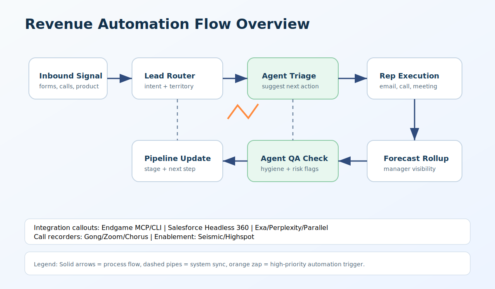

### [Deal Hygiene Machine](schematics/deal-hygiene-machine/)
[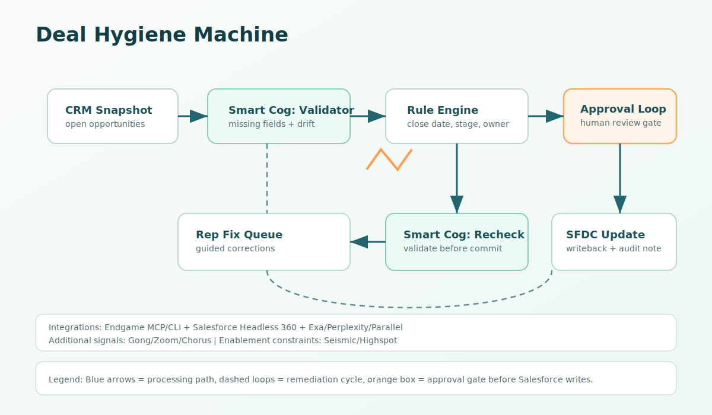](schematics/deal-hygiene-machine/)

### [Tier 3 Account Coverage Machine](schematics/tier-3-account-coverage-machine/)
[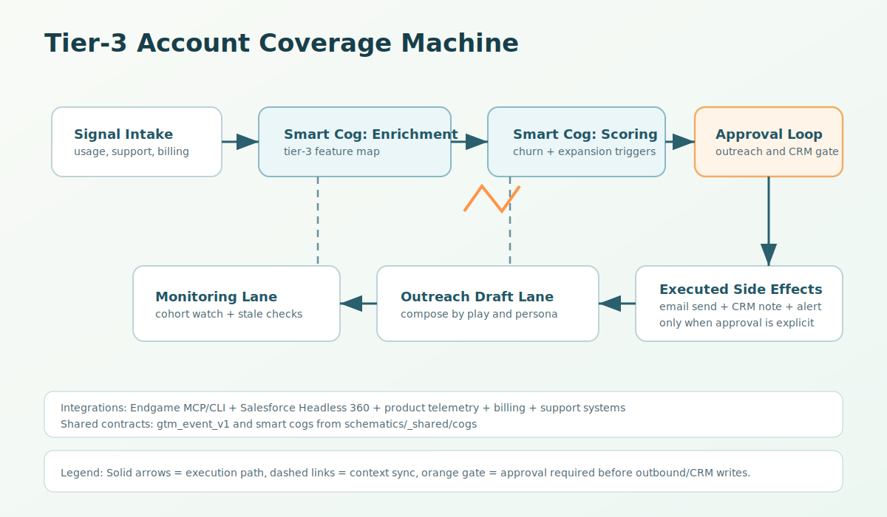](schematics/tier-3-account-coverage-machine/)

### [AI SDR Outbound Machine](schematics/ai-sdr-outbound-machine/)
[](schematics/ai-sdr-outbound-machine/)

### [Account Health Audit Machine](schematics/account-health-audit-machine/)
[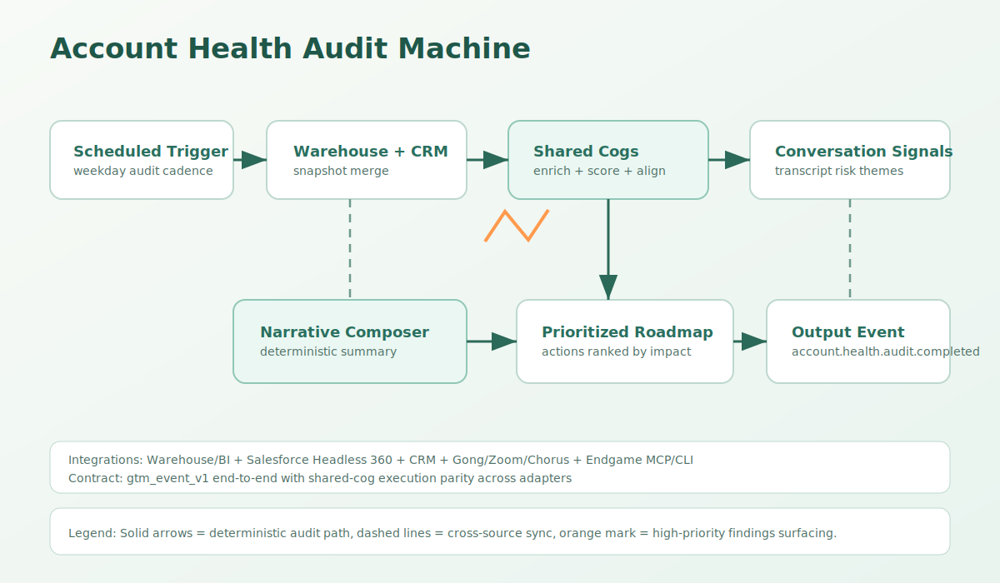](schematics/account-health-audit-machine/)

### [Consumption Renewal Intervention Machine](schematics/consumption-renewal-intervention-machine/)
[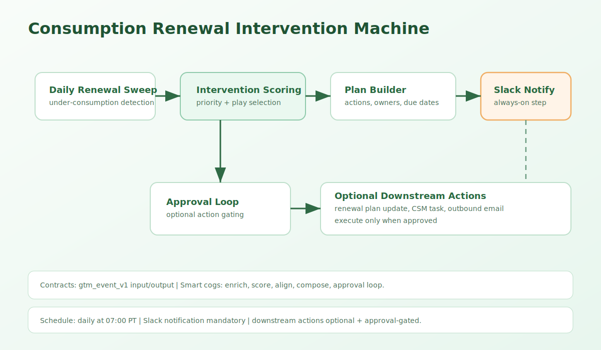](schematics/consumption-renewal-intervention-machine/)

### [Meeting Prep Brief Machine](schematics/meeting-prep-brief-machine/)
[](schematics/meeting-prep-brief-machine/)

### [Account Plan Generation Machine](schematics/account-plan-generation-machine/)
[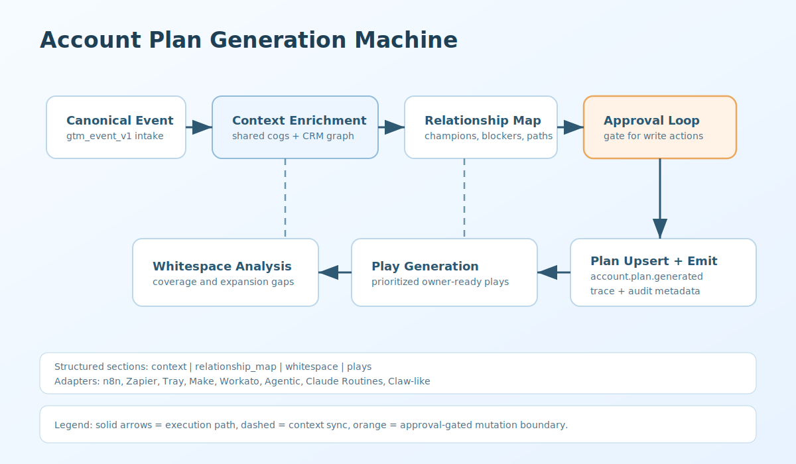](schematics/account-plan-generation-machine/)

### [Pipeline Review Intelligence Machine](schematics/pipeline-review-intelligence-machine/)
[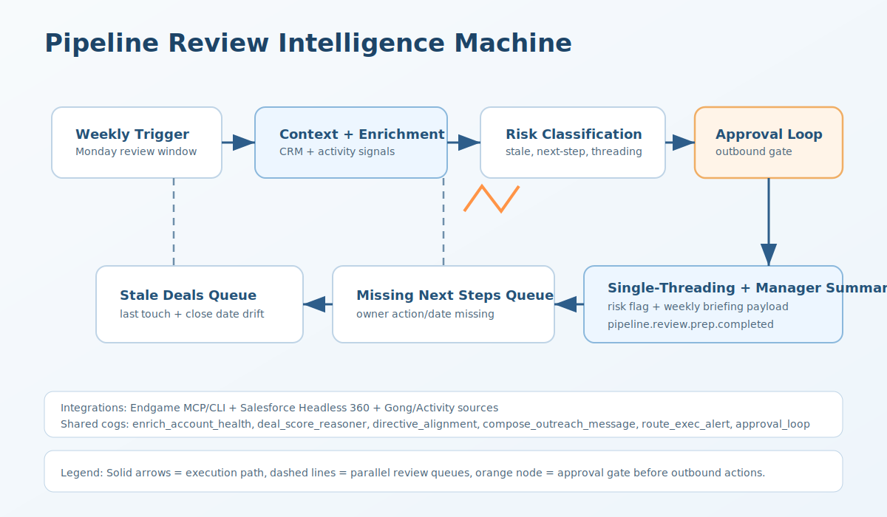](schematics/pipeline-review-intelligence-machine/)

### [Stage Change Deal Review Machine](schematics/stage-change-deal-review-machine/)
[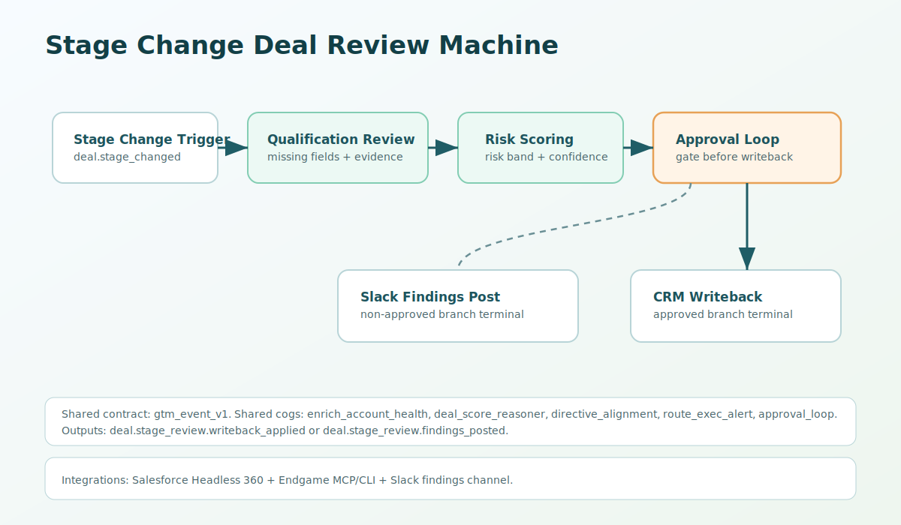](schematics/stage-change-deal-review-machine/)

### [New Hire Ramp Accelerator Machine](schematics/new-hire-ramp-accelerator-machine/)
[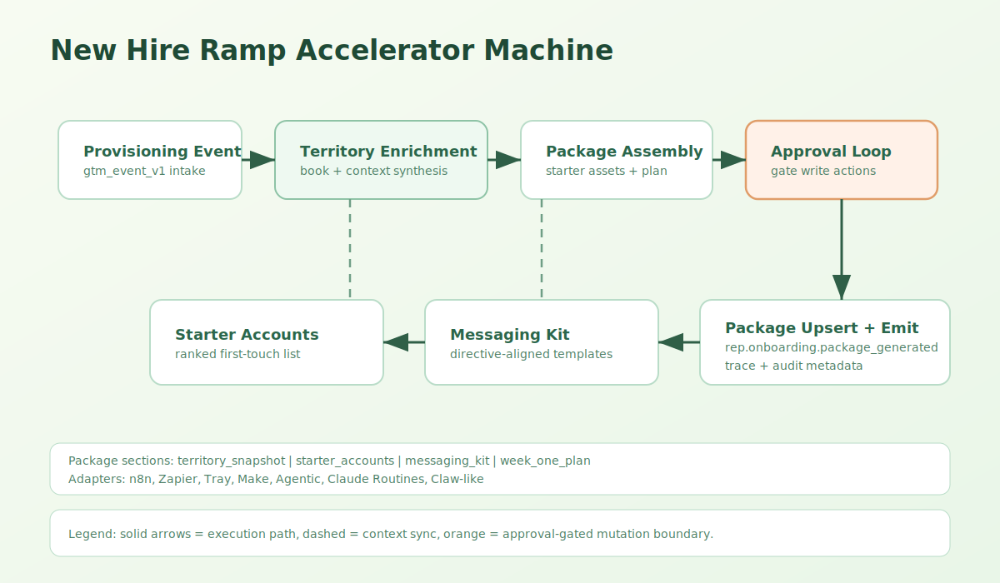](schematics/new-hire-ramp-accelerator-machine/)

### [Renewal Risk Monitoring Machine](schematics/renewal-risk-monitoring-machine/)
[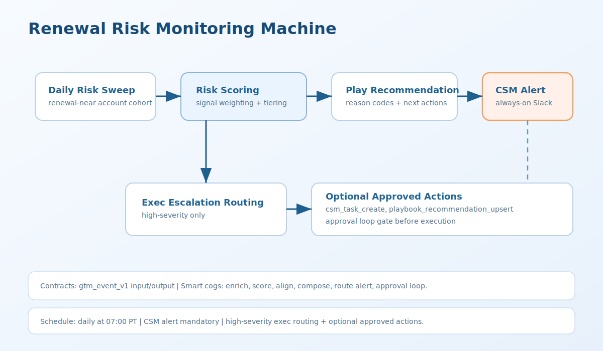](schematics/renewal-risk-monitoring-machine/)

### [Product Propensity Modeling Machine](schematics/product-propensity-modeling-machine/)
[](schematics/product-propensity-modeling-machine/)

### [Sales Coaching Machine](schematics/sales-coaching-machine/)
[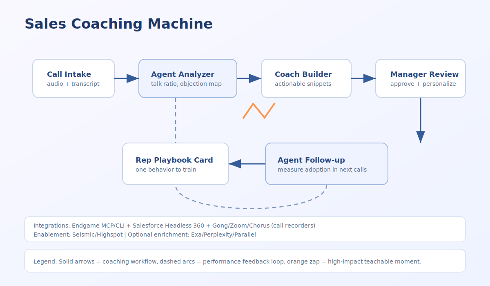](schematics/sales-coaching-machine/)

### [NRR Machine](schematics/nrr-machine/)
[](schematics/nrr-machine/)

### Approval Loop Cog
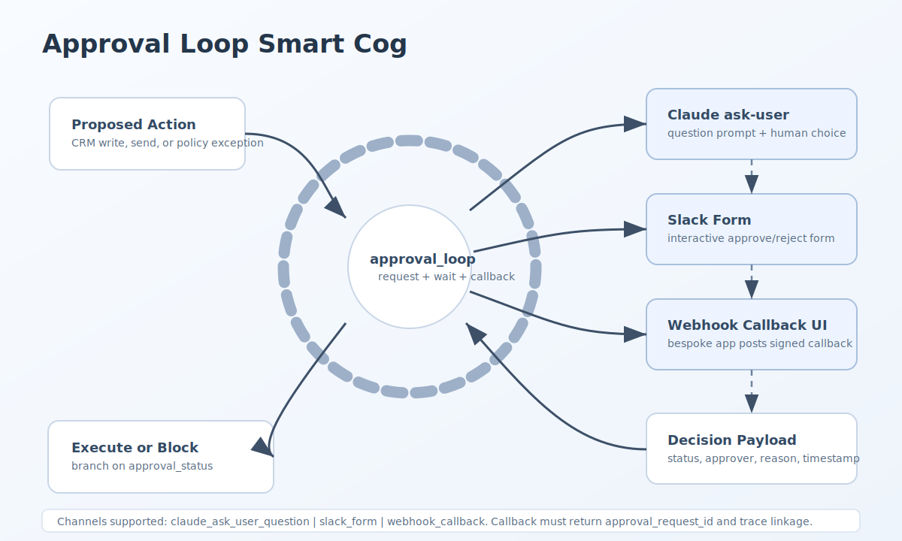

## Security and Publishing
- Never commit credentials, tenant IDs, webhook secrets, or customer data.
- Keep examples scrubbed/synthetic.
- See [`THIRD_PARTY_TERMS.md`](./THIRD_PARTY_TERMS.md) for platform usage boundaries.

## License
MIT for repository contents authored by Endgame Labs, Inc. See [`LICENSE`](./LICENSE).
Third-party platforms (including n8n) are governed by their own licenses and terms. See [`THIRD_PARTY_TERMS.md`](./THIRD_PARTY_TERMS.md).
