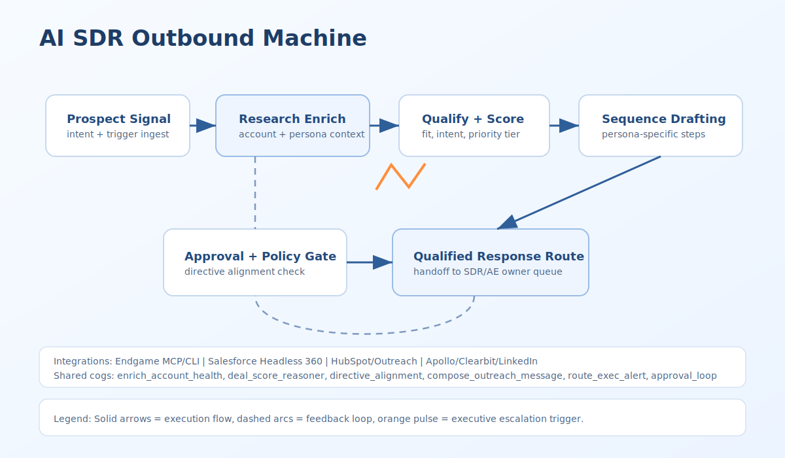

# Claude Routines Runtime (ai-sdr-outbound-machine)

## Purpose
Operational runtime guide for outbound research + sequence drafting + qualified response routing in Claude routines.

## Runtime Shape
- Claude cloud routine runs with no in-run permission prompts.
- Trigger mix:
  - API trigger for sales systems and alerting workflows.
  - Scheduled trigger for daily/weekly prospect cohorts.
  - GitHub trigger optional if outreach templates live in repo.

## Tool and MCP Wiring
- Read/context:
  - `endgame_mcp`, enrichment provider MCP/API, CRM read tools.
- Generation:
  - `compose_outreach_message`, `directive_alignment`, qualification scorer.
- Side effects:
  - `sequence_publish`, `email_send`, `crm_mutation`, `route_qualified_response`.

## Approval Checkpoints
- Mandatory `approval_loop` before:
  - publishing/sending outbound sequence steps.
  - any CRM mutation that changes owner/stage/status.
- Denied/expired approval -> `sdr.sequence.blocked` and no outbound send.

## External API/MCP Notes
- API `text` can include alert body / campaign hint; parse defensively.
- Scope MCP servers to exact outbound needs and disable unrelated connectors.

## Claude <-> ChatGPT Workspace Agent Interoperability
- Use `gtm_event_v1` as the sole cross-runtime handoff contract between Claude routines and Workspace Agents.
- Preserve `event_id`, `trace.trace_id`, persona/account subject fields, and qualification/approval attributes during transfers.
- Cross-runtime execution splits (draft in one runtime, publish in another) must still enforce `approval_loop` before outbound or CRM mutation.

## References
- https://code.claude.com/docs/en/routines
- https://code.claude.com/docs/en/mcp
- https://code.claude.com/docs/en/permissions
- https://code.claude.com/docs/en/sub-agents
