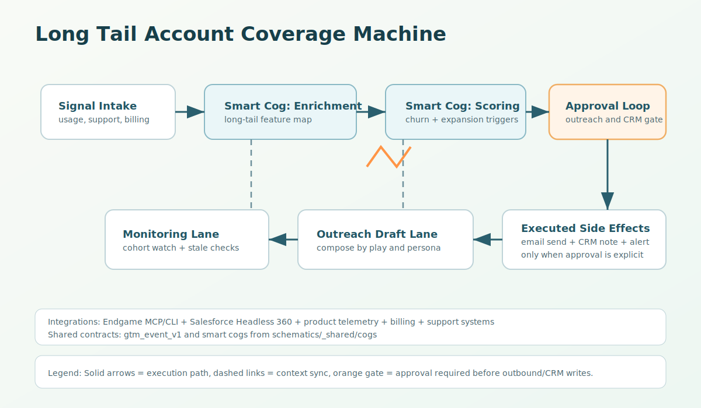

# Tray Adapter (long-tail-account-coverage-machine)

Tray implementation of long-tail account coverage automation with callable ingest and required approval gating before side effects.

## Artifact
- `workflow.json`: project-style starter artifact.

## Trigger Design
1. Callable trigger for canonical `gtm_event_v1` ingestion.
2. Optional scheduled trigger (`0 */6 * * *`, `America/Los_Angeles`) for cohort sweeps.

## Contract Semantics
1. Normalize and validate `gtm_event_v1`.
2. Enrich account context and compute coverage signals.
3. Gate to long-tail target segments (`low_touch`, `no_touch`).
4. Score churn/expansion trigger intensity.
5. Compose outreach plan and run approval.
6. Execute approved outbound/CRM actions.
7. Emit `longtail.coverage.executed` or `longtail.coverage.blocked`.

## Format Parity
- Compatibility posture: `workflow.json` tracks machine intent and step sequencing, but it is not the native Tray project/workflow export JSON envelope.
- Importability: reference scaffold, not fully importable as-is.
- Official docs/API examples: [Import / Export](https://tray.ai/documentation/platform/enterprise-core/lifecycle-management/import-export), [Projects API (import, requirements, preview, export)](https://tray.ai/documentation/developer/platform-apis/projects).
- Public template/community source: [Workflow Threading Template (Tray Library)](https://tray.ai/documentation/library/template/3a24d0a7-f940-4ac7-b455-6a11380fcde5-workflow-threading-template).
