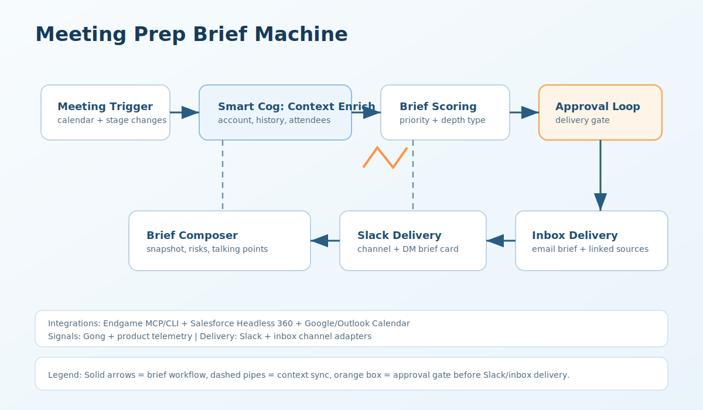

# Zapier Adapter (meeting-prep-brief-machine)

Zapier implementation for generating meeting prep briefs with deterministic scoring and approval-gated delivery.

## Artifact
- `zap.template.json`

## Format Parity
- Intent: `zap.template.json` in this folder is a reference template for build guidance, not a direct Zapier account export JSON.
- Compatibility posture: treat this artifact as design-time documentation. Zapier JSON import/export is available on Team and Enterprise plans and expects Zapier-exported JSON; this file may require manual rebuild in the Zap editor before it can be exported/imported between accounts.
- Official docs:
  - https://help.zapier.com/hc/en-us/articles/8496308481933-Import-and-export-Zaps-in-your-Team-or-Enterprise-account
  - https://help.zapier.com/hc/en-us/articles/8496292155405-Share-a-template-of-your-Zap
- Public template source:
  - https://zapier.com/templates

## Recommended Zap Shape
1. Trigger from upcoming-meeting webhook or periodic schedule sweep.
2. Validate contract and filter to supported meeting-related events.
3. Fetch account/opportunity context and compute prep priority.
4. Compose brief content and run approval gate.
5. Use `Paths`:
- Approved: deliver to Slack + inbox and emit `meeting.prep_brief.delivered`.
- Blocked: emit `meeting.prep_brief.blocked`.

## Practical Zapier Notes
- Keep webhook payloads compact; large transcript payloads should be summarized upstream.
- Use `Storage by Zapier` for dedupe and run-state markers.
- For common post-delivery tasks across branches, call a Sub-Zap from each path.

## Context Guidance
- Context can be assembled from Endgame MCP/CLI plus CRM/calendar providers.
- Keep context provider outputs namespaced in `attributes.context.<provider>`.

## References
- https://help.zapier.com/hc/en-us/articles/8496288690317-Trigger-Zaps-from-webhooks
- https://help.zapier.com/hc/en-us/articles/8496288555917-Add-branching-logic-to-Zaps-with-Paths
- https://help.zapier.com/hc/en-us/articles/8496310939021-Use-JavaScript-code-in-Zaps
- https://help.zapier.com/hc/en-us/articles/29971850476173-Code-by-Zapier-rate-limits
- https://help.zapier.com/hc/en-us/articles/8496241726989-Replay-Zap-runs
