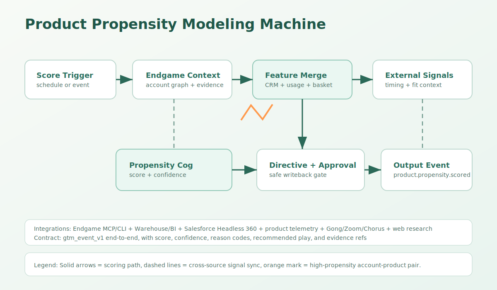

# Product Propensity Modeling Machine



## Purpose
Score how likely an account or client is to buy a specific product, using Endgame tools/context plus CRM, warehouse, usage, conversation, market-basket, and external signals.

## Where It Fits
Use this machine when teams want a portable propensity-scoring workflow that can accept an existing model output, run a native scoring module inside Endgame-aware orchestration, or combine both into an evidence-backed account-product score.

## Primary KPIs
- Propensity score coverage across eligible account-product pairs.
- Precision at top decile against accepted opportunities or purchases.
- Median score freshness for priority segments.

## Trigger Models
- Scheduled trigger:
  - Six-hour scoring refresh (`0 */6 * * *`) for priority account-product pairs.
- Event trigger:
  - `propensity.score_requested`, `propensity.context_ready`, `account.product_signal_changed` for ad hoc or signal-driven scoring.

## Required Context Layers
- Endgame MCP + `endgame-cli`:
  - Account graph, notes, datasets, documents, interaction history, directives, and traceable evidence refs.
- Warehouse/BI:
  - Purchases, product ownership, usage telemetry, market-basket/co-purchase lift, segment benchmarks, historical conversion labels.
- CRM:
  - Account hierarchy, industry, owner, active opportunities, installed products, buying committee, lifecycle stage.
- Conversation systems:
  - Gong/Zoom/Chorus summaries, objections, stated initiatives, competitor mentions, and executive intent.
- External signals:
  - Public company changes, hiring, funding, regulation, technology stack, intent data, or market events when enabled.

## Integration Callouts
- Core context plane:
  - Endgame MCP/CLI retrieves unified account-product context and evidence references.
- Predictive feature plane:
  - Warehouse/BI and product telemetry provide deterministic features and historical labels.
- Research plane:
  - External research augments fit and timing signals without becoming a required dependency.
- Action plane:
  - CRM writeback, audience sync, and seller alerts are approval-gated when they mutate downstream systems.

## End-to-End Flow (Canonical)
1. Ingest schedule/event trigger as `gtm_event_v1`.
2. Normalize account and product identity, scoring window, and idempotency key.
3. Pull Endgame context and resolve evidence refs.
4. Merge CRM, warehouse, product telemetry, market-basket, conversation, and optional external signals.
5. Run `propensity_score_reasoner` to produce score, band, confidence, reason codes, and recommended play.
6. Validate seller-facing explanation and play language with `directive_alignment`.
7. Route high-propensity or low-confidence exceptions with `route_exec_alert`.
8. Gate CRM writeback/audience sync through `approval_loop` when required.
9. Emit `product.propensity.scored` as `gtm_event_v1`.

## Smart Cogs Used
- `propensity_score_reasoner`:
  - Produces calibrated account-product score, confidence, reason codes, evidence refs, and play recommendation.
- `directive_alignment`:
  - Ensures seller-facing explanation and recommended play follow approved directives.
- `route_exec_alert`:
  - Routes high-propensity, high-value, low-confidence, or stale-context exceptions.
- `approval_loop`:
  - Gates CRM mutations, outbound sends, and audience-sync side effects.

## Pluggable Interfaces
- Context providers (swap-in):
  - `endgame_mcp`, `endgame_cli`, `warehouse_bi`, `salesforce_headless_360`, `salesforce`, `hubspot`, `product_telemetry`, `gong`, `zoom`, `web_research`.
- Model providers (swap-in):
  - Existing market-basket model output, deterministic feature scoring, warehouse ML score table, or agentic score reasoner.
- Action providers (swap-in):
  - CRM field writeback, seller Slack alert, audience export, campaign membership sync, opportunity/task creation.

## Configuration Example
```yaml
machine:
  id: product-propensity-modeling-machine
  trigger_mode:
    schedule_cron: "0 */6 * * *"
    timezone: "America/Los_Angeles"
  providers:
    context:
      - endgame_mcp
      - warehouse_bi
      - salesforce_headless_360
      - product_telemetry
      - gong
    optional_research:
      - web_research
    actions:
      - propensity_score_publish
      - crm_propensity_field_upsert
      - seller_alert_route
  scoring:
    high_threshold: 80
    medium_threshold: 55
    min_confidence_for_writeback: medium
```

## Example Input/Output
Input event (simplified):
```json
{
  "schema_version": "gtm_event_v1",
  "event_id": "evt_propensity_001",
  "event_type": "propensity.score_requested",
  "source": "endgame",
  "occurred_at": "2026-04-24T16:00:00Z",
  "ingested_at": "2026-04-24T16:00:03Z",
  "trace": { "trace_id": "tr_propensity_001" },
  "subject": { "entity_type": "account", "entity_id": "001xx00000ACCT42", "account_id": "acct_42" },
  "attributes": {
    "product_id": "payments_plus",
    "scoring_window": "90d",
    "context_refs": ["endgame://accounts/acct_42"]
  }
}
```

Output event (simplified):
```json
{
  "schema_version": "gtm_event_v1",
  "event_type": "product.propensity.scored",
  "subject": { "entity_type": "account", "entity_id": "001xx00000ACCT42", "account_id": "acct_42" },
  "attributes": {
    "product_id": "payments_plus",
    "propensity_score": 82,
    "propensity_band": "high",
    "score_confidence": "medium",
    "reason_codes": ["peer_affinity", "adjacent_product_usage", "active_buying_initiative"],
    "recommended_play": "route_to_owner_with_value_hypothesis",
    "evidence_refs": ["endgame://evidence/propensity/acct_42/payments_plus"]
  }
}
```

## Adapter Notes
- `n8n/`: Preserve score thresholds, reason-code schema, idempotency behavior, and terminal event names.
- `zapier/`: Preserve score thresholds, reason-code schema, idempotency behavior, and terminal event names.
- `tray/`: Preserve score thresholds, reason-code schema, idempotency behavior, and terminal event names.
- `make/`: Preserve score thresholds, reason-code schema, idempotency behavior, and terminal event names.
- `workato/`: Preserve score thresholds, reason-code schema, idempotency behavior, and terminal event names.
- `agentic/`: Use Endgame context tools for evidence gathering and keep score output contract-bound.
- `claude-routines/`: Use Endgame context steps for evidence gathering and keep score output contract-bound.
- `claw-like/`: Drive six-hour refreshes and stale-score detection from `HEARTBEAT.md`.

## ChatGPT Workspace Agents Support
- ChatGPT and Slack surfaces:
  - This machine can be exposed as a Workspace Agent for account/product lookup, score explanation, and approval-gated writeback while preserving `gtm_event_v1` boundaries.
- Cloud and background runs:
  - Scheduled scoring refreshes and ad hoc score requests can run in cloud/background mode with deterministic completion emits.
- Approval gates for sensitive actions:
  - Read-only scoring and explanation can auto-run; CRM writes, seller alerts, audience syncs, and outbound actions remain approval-gated.
- Governance and visibility:
  - Workspace governance should retain model version, feature snapshot, evidence refs, rationale, `event_id`, and `trace` for replay and calibration.

## Safety and Audit
- Preserve `event_id` and `trace.trace_id` through all phases.
- Keep raw sensitive features out of seller-facing score explanations.
- Emit score confidence, reason codes, model/cog version, and evidence refs for auditability.
- Treat low-confidence high-score outputs as review-required before downstream mutation.
